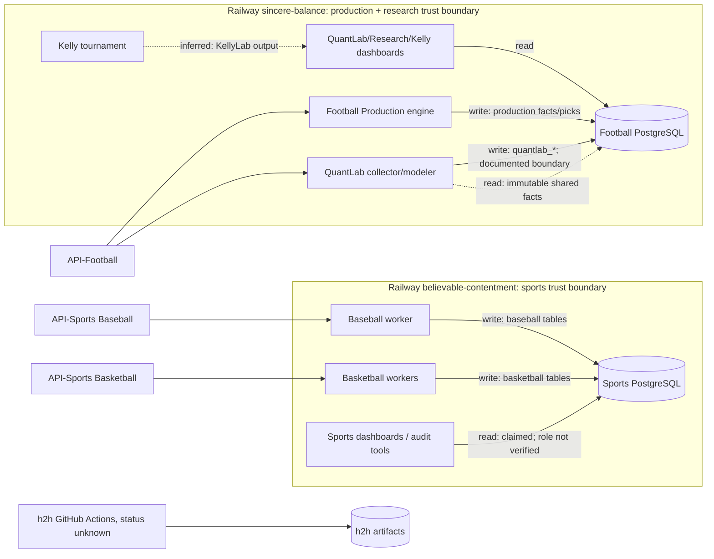

# QuantBet Control Tower — arhitektonski audit, 10. oktobar 2026.

Status: **read-only discovery / Phase A**. Presek Railway metapodataka: `2026-10-10T01:47:58Z`. Kod: `v2quantbet` [`8352f01`](https://github.com/Filip1994/v2quantbet/commit/8352f01a9d00ecfcd6a58e95537660a59fa6df55), `h2h` [`b64fd50`](https://github.com/Filip1994/h2h/commit/b64fd507590a6d95ac0d3e56fd906f757fc79f5c), `quantbet-baseball` [`ed2e1c4`](https://github.com/Filip1994/quantbet-baseball/commit/ed2e1c4f2756b179f182fac5c32b9fc86f8e80e7), `quantbet-basketball` [`4987bbc`](https://github.com/Filip1994/quantbet-basketball/commit/4987bbc23a40457aa4deef5c1b0761a3c5dcd394). [Issue #242](https://github.com/Filip1994/v2quantbet/issues/242) je opseg i kriterijum prihvatanja.

## Sažetak za vlasnika

QuantBet ima jasne granice u kodu između Football Production, Research i QuantLab laboratorija, testove i istoriju odluka. Operativna slika je znatno manje jasna: dva Railway projekta sadrže **48 registrovanih servisa** (18 + 30); samo **13** je u trenutku pregleda imalo bar jednu instancu sa statusom `RUNNING`. Status `SUCCESS` poslednjeg deploymenta nije isto što i aktivan proces. Četrnaest definicija ima cron, a mnogi jednokratni dijagnostički servisi su zadržani. Nijedan servis nije obrisan ili promenjen.

Najveći provereni rizici su zajednički PostgreSQL unutar svakog Railway projekta, veliki broj trajno registrovanih jednokratnih definicija, nejasan status više cron servisa između pokretanja i nedovoljno dokazano odvajanje privilegija na nivou baze. Railway metapodaci potvrđuju deployment i instancu, ali **ne potvrđuju** ispravnost pickova, svežinu redova, stvarnu uspešnost cron ciklusa, backup restore, trošak, profitabilnost ili least-privilege. Te stavke su označene kao neproverene.

**Preporuka:** zadržati postojeće dve Railway celine i tri osnovna repozitorijuma; dodati samo offline registar, snapshot diff i operativni vodič. Nema osnova za novi stalni servis. Kandidati za pojednostavljenje se prvo proveravaju kroz vlasništvo, istoriju izvršavanja, zavisnosti i rollback; ova revizija ne predlaže automatsko gašenje.

### Read-only dopuna, 2026-10-10T09:50:02Z

Drugi sanitizovani Railway presek ponovo vraća 48 definicija, ali **12** servisa sa `RUNNING` instancom. [Stvarni snapshot diff](generated/observed-diff/SNAPSHOT_DIFF.md) pokazuje dve promene: `quantbet-baseball-cold-storage` je prešao sa `SUCCESS` na `CRASHED` bez promene deployment vremena, a `quantbet-quantlab-collector` više nema trenutno `RUNNING` instancu. Collector je cron (`0 * * * *`), pa nula instanci između ciklusa nije dokaz kvara. Cold-storage cron ima `CRASHED` status poslednjeg deploymenta i zahteva pregled poslednjeg job loga/freshness; uticaj na podatke **nije potvrđen**. Ova dopuna ne menja betting tok ni infrastrukturu.

## Metod i granice dokaza

- `verified`: direktan Git fajl/commit ili Railway CLI `status --json` polje u navedenom preseku.
- `inferred`: zaključak iz imena, entrypointa ili dokumentovanog ugovora; ne tvrdi se da je runtime putanja potvrđena.
- `unknown`: nema dovoljno dokaza. Odsustvo dokaza nije negativan nalaz.
- Servis `created_at` Railway CLI nije izložio u ovom preseku. `first_seen_at` je **vreme prvog snimka registra**, ne datum nastanka servisa. `last_changed` je poslednji deployment ili Git commit, ne poslednja promena konfiguracije.
- Za service-to-table mapu korišćeni su [migracije](https://github.com/Filip1994/v2quantbet/tree/8352f01a9d00ecfcd6a58e95537660a59fa6df55/migrations), [QuantLab arhitektura](https://github.com/Filip1994/v2quantbet/blob/8352f01a9d00ecfcd6a58e95537660a59fa6df55/QuantLab/ARCHITECTURE.md) i entrypointi. Nisu čitane produkcione tabele, vrednosti environment promenljivih niti poverljivi logovi.
- Susedni repozitorijumi su pregledani na HEAD-u. `h2h` opisuje odvojeni GitHub Actions paper-trading tok; nije pronađena njegova veza sa ova dva Railway projekta. Time nije potvrđeno da je aktivan u produkciji.
- Dva Railway projekta su jedini projekti vraćeni dostupnim nalogom u trenutku pregleda. Drugi nalozi, eksterni scheduler i privatni repozitorijumi ostaju van potvrđenog opsega.

Sanitizovan sirovi presek je u [`fixtures/railway-2026-10-10.json`](fixtures/railway-2026-10-10.json). U njemu nema komandi pokretanja, varijabli, connection stringova ni e-mail adresa. Detaljan status svake definicije je u [registru](SERVICE_INVENTORY.md).

## Šta postoji i kako je povezano

| Oblast | Potvrđeni repozitorijum / putanja | Runtime i izvor | Tok podataka / granica |
| --- | --- | --- | --- |
| Football Production | [`src/h2h/entrypoint.py`](https://github.com/Filip1994/v2quantbet/blob/8352f01a9d00ecfcd6a58e95537660a59fa6df55/src/h2h/entrypoint.py) | Railway `quantbet-engine`, API-Football | `fixtures`, quote history, modeli, odluke, `registered_picks`, settlement i bankroll u football PostgreSQL. [README](https://github.com/Filip1994/v2quantbet/blob/8352f01a9d00ecfcd6a58e95537660a59fa6df55/README.md). |
| Football Research | [`research_dashboard_entrypoint.py`](https://github.com/Filip1994/v2quantbet/blob/8352f01a9d00ecfcd6a58e95537660a59fa6df55/src/h2h/research_dashboard_entrypoint.py), `postgres_research_signals.py` | Railway `quantbet-research` | `research_signals`; istorijski/istraživački rezultat ne predstavlja Production P&L. |
| QuantLab, Goal/Corner/Card/H2H | [`src/h2h/quantlab`](https://github.com/Filip1994/v2quantbet/tree/8352f01a9d00ecfcd6a58e95537660a59fa6df55/src/h2h/quantlab) | dashboard, collector, modeler; API-Football | Deljeni football PostgreSQL za čitanje zajedničkih činjenica; upis u `quantlab_*` ledger/tabele. Ugovor zabranjuje upis u produkcione pick, bankroll i model state; stvarne DB privilegije nisu proverene. |
| KellyLab / Tournament | [`kellylab_dashboard_entrypoint.py`](https://github.com/Filip1994/v2quantbet/blob/8352f01a9d00ecfcd6a58e95537660a59fa6df55/src/h2h/kellylab_dashboard_entrypoint.py) | `quantbet-kellylab` iz `v2quantbet`; tournament bez Git source ref u Railway preseku | Shadow portfolio; tournament potrošač KellyLab izlaza je **inferred** iz servisne konfiguracije, ne iz izvornog repozitorijuma. |
| Baseball | [`quantbet-baseball`](https://github.com/Filip1994/quantbet-baseball/tree/ed2e1c4f2756b179f182fac5c32b9fc86f8e80e7/src/quantbot/baseball) | Railway worker/dashboard/cold storage, API-Sports Baseball | Zaseban PostgreSQL u sportskom Railway projektu; README još opisuje lokalne JSONL artefakte, kod koristi PostgreSQL — dokumentacioni drift koji treba usaglasiti. |
| Basketball v1/v2 | [`quantbet-basketball`](https://github.com/Filip1994/quantbet-basketball/tree/4987bbc23a40457aa4deef5c1b0761a3c5dcd394/src/quantbet_basketball), deo starijih servisa iz `quantbet-baseball` | Railway worker/research/dashboard/cold storage, API-Sports Basketball | Isti sportski Railway PostgreSQL; razgraničenje tabela/DB role između v1/v2 nije potvrđeno. |
| `h2h` paper-trading | [`h2h`](https://github.com/Filip1994/h2h/tree/b64fd507590a6d95ac0d3e56fd906f757fc79f5c) | GitHub Actions opisani u README; u pregledanom HEAD-u `.github/workflows` nije prisutan | Odvojen tok i statički dashboard; aktuelna aktivnost/hosting nisu potvrđeni. |

### Dijagram zavisnosti i granice poverenja

**Blast radius:** prekid football PostgreSQL utiče na Production i više čitalačkih/istraživačkih površina; prekid sports PostgreSQL utiče na Baseball i Basketball. Railway prikazuje po jednu PostgreSQL definiciju po projektu; replikacija, backup i restore nisu provereni. Deljena infrastruktura nije dokaz zajedničkog DB naloga ili neograničenog upisa.

## Šta / kada / zašto — dokaziva istorija

| Šta | Kada / veza sa deployem | Dokumentovani razlog ili granica |
| --- | --- | --- |
| QuantLab foundation i izolacija | 2026-09-26; [WORKLOG](https://github.com/Filip1994/v2quantbet/blob/8352f01a9d00ecfcd6a58e95537660a59fa6df55/QuantLab/WORKLOG.md) | Zaseban research prostor sa shadow ledgerom i bez produkcionih write odgovornosti. Tadašnji limit 1.000/day je istorijski; [trenutni ugovor](https://github.com/Filip1994/v2quantbet/blob/8352f01a9d00ecfcd6a58e95537660a59fa6df55/QuantLab/ARCHITECTURE.md) kaže zajednički 75.000/day. |
| Per-lab kill switches | commit [`886af1c`](https://github.com/Filip1994/v2quantbet/commit/886af1c); collector `-ACut` na tom ref-u; [OPERATIONS](https://github.com/Filip1994/v2quantbet/blob/8352f01a9d00ecfcd6a58e95537660a59fa6df55/QuantLab/OPERATIONS.md) | Omogućuju zaustavljanje jedne grane bez brisanja istorije; CardLab je u dokumentu isključen. Stvarne Railway vrednosti nisu čitane. |
| Archive lifecycle | commit [`39226ad`](https://github.com/Filip1994/v2quantbet/commit/39226ad); Railway cron `40 * * * *` | Commit govori o ECR mirroru; **razlog tog konkretnog redeploya je nepoznat** bez PR/deployment napomene. |
| Football Production intake pilot | commit [`8352f01`](https://github.com/Filip1994/v2quantbet/commit/8352f01a9d00ecfcd6a58e95537660a59fa6df55), engine/dashboard/research 2026-10-10 UTC | Commit/izmenjeni testovi dokumentuju pilot Research OU 2.5 bucketova; audit ne ocenjuje odluku niti ROI. |
| Basketball v2 rollout | posebni v2 worker/dashboard/cold storage iz [`quantbet-basketball`](https://github.com/Filip1994/quantbet-basketball) | Potreba za paralelnim v1/v2 servisima i datum penzionisanja v1: **reason unknown**. |
| Diagnostički `*-query`, `*-audit`, `*-test` servisi | Railway poslednji deployment često u septembru/oktobru; većina `EXITED` | Svrha je sugerisana imenom ili start modulom, ali poslovni razlog, vlasnik i rok uklanjanja nisu dokumentovani. Ne označavati ih bezbednim za brisanje. |

Za svaki registrovani servis snapshot čuva poslednji deployment i commit kada postoji. Railway konfiguracione promene između deploya nisu dostupne u ovom preseku. Istorija iz Git-a ne dokazuje zašto je neko promenio Railway varijablu.

## Ocena arhitektonskih oblasti

**Rubrika 1–10:** `1–2` = potvrđen kritičan nedostatak osnovne kontrole; `3–4` = kontrola je dokumentovana ili delimična, bez dokaza da se pouzdano sprovodi; `5–6` = implementirana i testirana kontrola, ali nema dovoljno runtime/restore dokaza; `7–8` = kontrola je potvrđena u CI i operativnom radu sa merljivim oporavkom; `9–10` = ponovljeno nezavisno validirana kontrola i trend. Ocena meri **dokazanu tehničku kontrolu**, ne kvalitet betting rezultata. `N/P` znači nije procenjeno: nedostaju minimalni dokazi. Pouzdanost: visoka = kod + nezavisni runtime/test dokaz; srednja = kod + docs ili CI konfiguracija; niska = samo konfiguracija/dokument.

| Oblast | Ocena | Pouzdanost | Dokaz i slepa tačka | Sledeći proverljiv korak |
| --- | ---: | --- | --- | --- |
| Kohezija i modularnost | 6 | srednja | Odvojeni `production`, `research`, `quantlab` moduli i laboratorije; veliki zajednički repo i shared core. | Mapirati import cikluse i vlasništvo po modulima. |
| Coupling i shared state | 4 | srednja | [QuantLab ugovor](https://github.com/Filip1994/v2quantbet/blob/8352f01a9d00ecfcd6a58e95537660a59fa6df55/QuantLab/ARCHITECTURE.md) eksplicitno deli PostgreSQL; DB role/grant nisu provereni. | Read-only pregled DB role/grant i service→table matrice. |
| Data lineage / temporal leakage | 6 | srednja | `available_at`, append-only trigeri u [migracijama 025–026](https://github.com/Filip1994/v2quantbet/tree/8352f01a9d00ecfcd6a58e95537660a59fa6df55/migrations); nema uzorka stvarnih feature zapisa. | Read-only point-in-time uzorak bez ličnih podataka. |
| Test pokrivenost i pouzdanost | 6 | srednja | 151 test fajl u `v2quantbet`, [CI lint+pytest](https://github.com/Filip1994/v2quantbet/blob/8352f01a9d00ecfcd6a58e95537660a59fa6df55/.github/workflows/ci.yml); nema coverage/trenda flakiness. | Dodati izveštaj pokrivenosti i seriju CI rezultata u snapshot. |
| CI i release higijena | 5 | srednja | PR CI postoji; [Railway predeploy migracija](https://github.com/Filip1994/v2quantbet/blob/8352f01a9d00ecfcd6a58e95537660a59fa6df55/railway.json) spaja deploy i schema apply; branch protection nije proverena. | Prikupiti read-only CI/deployment korelaciju. |
| Rollback i recoverability | N/P | niska | Nema restore testa, RPO/RTO ili backup politike u dostupnom preseku. | Potvrditi Railway backup konfiguraciju i poslednji restore test. |
| Observability / alerting | 5 | srednja | Health/readiness, worker status i dashboard postoje; nema potvrđenog centralnog alert routinga ili SLO. | Evidentirati heartbeat, cron success i alert test. |
| Incident handling | 4 | srednja | Razni audit i dijagnostički servisi postoje, ali nemaju centralni lifecycle/owner; runbook do sada nije centralan. | Koristiti [RUNBOOK](RUNBOOK.md) i beležiti incident linkove. |
| Secrets / least privilege | N/P | niska | Kod kaže da secrets nisu u Git-u; stvarne Railway varijable/DB grantovi nisu čitani. | Bez izlaganja vrednosti prikupiti spisak imena varijabli i DB role/grant. |
| DB migracije / backup / retention | N/P | niska | 75 migration fajlova i cold storage implementacija; backup, restore i retention izvršavanje nisu provereni. | Dokaz restore probe i age/size metrika. |
| Runtime trošak / API budžeti | 5 | srednja | [QuantLab 75k/day ugovor](https://github.com/Filip1994/v2quantbet/blob/8352f01a9d00ecfcd6a58e95537660a59fa6df55/QuantLab/ARCHITECTURE.md), provider usage tabela; stvarna potrošnja i račun nisu mereni. | Read-only usage i cost metrika za 30 dana. |
| Deploy složenost | 4 | visoka | 48 Railway definicija, 14 cron; 17 definicija bez Git source ref u snapshotu. | Obeležiti owner, namenu, lifetime i rollback za svaku. |
| Single points of failure | 4 | srednja | Po jedan PostgreSQL servis u oba projekta; football engine `numReplicas=1` u configu. HA i backup nisu potvrđeni. | Read-only proveriti HA/backup/restore i leader failover. |
| Skalabilnost | N/P | niska | Cron/leader dizajn je vidljiv, ali nema load, queue lag ili kapacitetskih merenja. | Izmeriti ciklus, backlog, rate limit i DB saturaciju. |
| Održavanje | 5 | srednja | Protokol promena i testovi postoje; README Baseball i Railway/Postgres implementacija se razilaze. | Uskladiti docs i dodati automatizovan drift check. |
| Operativno mentalno opterećenje | 3 | visoka | 48 definicija u dva projekta; 35 bez trenutno `RUNNING` instance, broj uključuje cron/one-shot. | Centralni registar i eksplicitni status/lifecycle. |

Nijedna ocena ne dokazuje poslovnu spremnost, buduću prednost modela ili ROI. `SLEEPING`, `CREATED` i `EXITED` se ne pretvaraju automatski u incident.

## Rizici — ozbiljnost × verovatnoća

Skala: ozbiljnost `1–3` (lokalna, više modula, produkcijski tok), verovatnoća `1–3` (hipotetička, poznat put, opažena); prioritet je proizvod, a ne finansijska prognoza.

| ID | Rizik i dokaz | S×V | Pouzdanost | Bezbedna preporuka |
| --- | --- | ---: | --- | --- |
| R1 | Shared football PostgreSQL povezuje Production i QuantLab; [ugovor](https://github.com/Filip1994/v2quantbet/blob/8352f01a9d00ecfcd6a58e95537660a59fa6df55/QuantLab/ARCHITECTURE.md). Neznan DB grant znači da izolacija može zavisiti od koda. | 3×2=6 | srednja | Read-only mapirati role/grant, zatim predložiti najmanje privilegije u zasebnom PR-u. |
| R2 | 48 registrovanih servisa, 17 bez Git source ref; sanitizovan [snapshot](fixtures/railway-2026-10-10.json). Neproverene definicije povećavaju šansu pogrešne operacije. | 2×3=6 | visoka | Registar sa ownerom, klasom i dokazom; ništa ne brisati automatski. |
| R3 | Nema dokaza o restore testu za oba PostgreSQL servisa. Gubitak DB bi imao širok blast radius. | 3×1=3 | niska | Zatražiti dokaz backup/restore procesa; bez produkcionog write testa u ovom zadatku. |
| R4 | Jedan stari football one-shot ostaje `FAILED`; u kasnijem preseku Baseball cold storage cron je `CRASHED`. Status nije dokaz korisničkog uticaja niti gubitka podataka. | 2×2=4 | visoka za status, niska za uticaj | Pregled poslednjeg uspešnog cron ciklusa, loga i data freshness bez restarta. |
| R5 | Baseball README opisuje JSONL kao canonical evidence, a kod zahteva `DATABASE_URL`; [README](https://github.com/Filip1994/quantbet-baseball/blob/ed2e1c4f2756b179f182fac5c32b9fc86f8e80e7/README.md), [DB](https://github.com/Filip1994/quantbet-baseball/blob/ed2e1c4f2756b179f182fac5c32b9fc86f8e80e7/src/quantbot/baseball/db.py). | 2×2=4 | srednja | Dokumentovati aktuelni data contract i zadržati istorijsku napomenu. |
| R6 | Basketball v1 servis iz Baseball repo i v2 iz Basketball repo koegzistiraju; v1 start modul `quantbot.basketball.worker` nije pronađen u izvornom `ed2e1c4` stablu. Poslednji uspešan stvarni run i potrošači nisu potvrđeni. | 2×2=4 | srednja | Uporediti tabele, consumer-e i poslednje korišćenje; tek potom retirement plan. |
| R7 | Railway `SUCCESS` za završeni one-shot može izgledati kao aktivna zaštita. | 2×3=6 | visoka | Prikazati deployment, instance, cron i fresh data odvojeno. |
| R8 | Nije potvrđeno da `h2h` README navedeni GitHub Actions tok postoji na pregledanom HEAD-u. | 1×2=2 | srednja | Proveriti workflow lokaciju/branch i aktivni scheduler pre uvrštavanja u operativnu sliku. |

## Deset malih, niskorizičnih koraka

1. Čuvati sanitizovan Railway/Git snapshot sa vremenom i SHA, bez konfiguracionih vrednosti.
2. Za svih 48 definicija postaviti `verified/inferred/unknown` uz direktan dokaz.
3. Razdvojiti `registered`, `running`, `scheduled`, `sleeping`, `stopped` i `failed`.
4. Prikazati `reason unknown` kada nema PR/doc obrazloženja.
5. Čuvati diff snapshotova, uključujući owner/permission/cron drift.
6. Dodati jednu service→repo→entrypoint→DB read/write mapu.
7. Uskladiti Baseball README sa stvarnim PostgreSQL ugovorom kroz dokumentacioni PR.
8. Potvrditi poslednji uspešan cron ciklus i freshness iz već postojećih heartbeat tabela, read-only.
9. Prikupiti backup/restore dokaz, DB role/grant i CI istoriju bez menjanja konfiguracije.
10. Pregledati jednokratne servise sa vlasnikom i zavisnostima; predlog gašenja tek po odobrenju.

## Sledeća revizija i granice

Control Tower V1 treba pokretati lokalno ili u CI **ručno**, iz sanitizovanih fixture fajlova. Ne uvoditi scheduler, Railway servis, novi DB, public dashboard ili automatski deploy. Kandidati za dodatni, autorizovan read-only konektor su GitHub commit/PR/CI metapodaci, Railway deployment/cron status i agregirani DB freshness/role podaci. Svi izvori moraju imati timestamp, source ref i redakciju tajni. V1 ne sme automatski menjati betting logiku, modele, routing, bankroll, exposure ni produkcione podatke.
